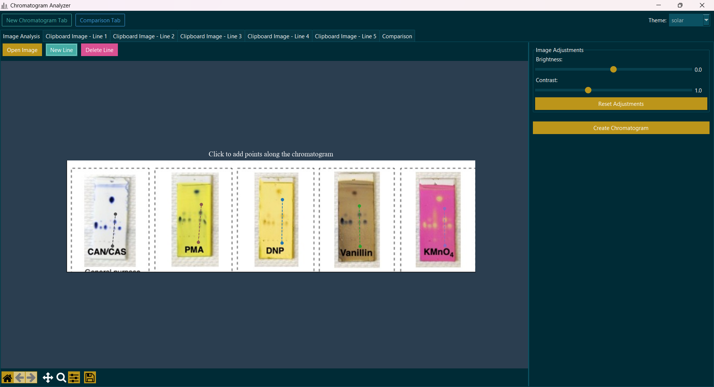
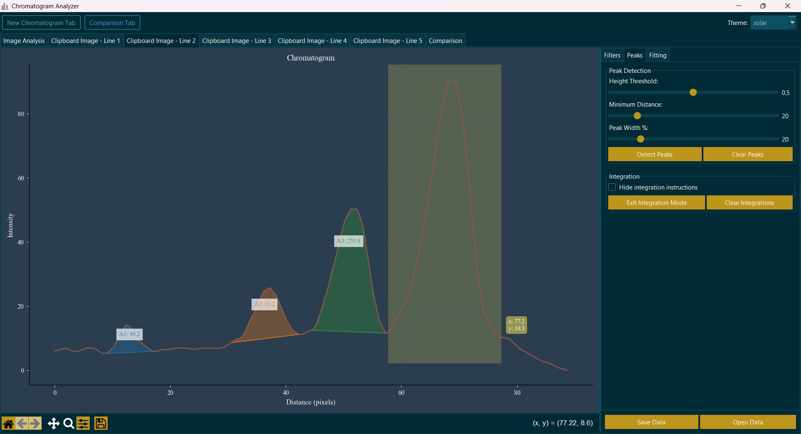
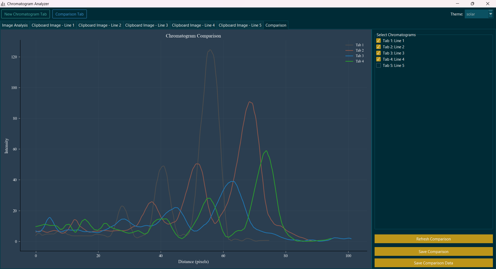

# Chromatogram Analyzer

A Python application for analyzing TLC (Thin Layer Chromatography) images and extracting quantitative data. The application features a customizable theme system with both light and dark themes. It works with various staining methods including iodine, ninhydrin, UV, and other chemical stains commonly used in TLC.

## Features

- Load and process chromatogram images from files or clipboard
- Draw multiple profile lines for analysis with adjustable band width
- Extract intensity profiles from images with various staining methods
- Apply filters for signal processing (Savitzky-Golay, Gaussian smoothing)
- Detect peaks in chromatograms with adjustable sensitivity
- Integrate peaks automatically or manually with baseline correction
- Fit peaks with Mecozzi asymmetric exponential function
- Compare multiple chromatograms in a single view
- Adjust image brightness and contrast for better visualization
- Save and load analysis data in various formats
- Export results as CSV or images
- Customizable UI with light and dark themes

## Installation

1. Clone this repository:
   ```
   git clone https://github.com/yourusername/chromatogram-analyzer.git
   cd chromatogram-analyzer
   ```

2. Run the launcher script, which will check for and install required dependencies:
   ```
   python launcher.py
   ```

## Usage

1. Run the application using the launcher script:
   ```
   python launcher.py
   ```
   On windows you can run TLCImager.bat.

2. **Image Tab**: Load and prepare your TLC image
   - Load an image using the "Open Image" button or paste from clipboard
   - Adjust brightness and contrast as needed
   - Add profile lines by clicking "New Line" and then clicking points on the image
   - Adjust band width for optimal signal extraction
   - Extract profiles using "Extract & Analyze"

   

3. **Chromatogram Tab**: Analyze extracted profiles
   - Apply filters to smooth the data (Savitzky-Golay, Gaussian)
   - Detect peaks with adjustable sensitivity
   - Integrate peaks automatically or manually
   - Fit peaks with Mecozzi asymmetric exponential function
   - View quantitative results in the data table

   

4. **Comparison Tab**: Compare multiple chromatograms
   - Select profiles from different analyses
   - Normalize and align chromatograms as needed
   - Compare peak positions and intensities
   - Export comparison data

   

5. Save your results using "Save Data" in various formats

## Requirements

- Python 3.6 or higher
- NumPy >= 1.20.0
- Matplotlib >= 3.4.0
- OpenCV-Python >= 4.5.0
- SciPy >= 1.7.0
- Pandas >= 1.3.0
- llvmlite >= 0.39.0
- numba >= 0.56.0
- ttkbootstrap >= 1.10.1
- Pillow >= 9.0.0

## Project Structure

```
chromatogram-analyzer/
├── launcher.py              # Entry point script with virtual environment management
├── TLCImager.bat            # Windows batch file for easy launching
├── src/                     # Source code directory
│   ├── __init__.py          # Package initialization
│   ├── app.py               # Main application class
│   ├── chromatogram_tab.py  # Chromatogram analysis tab implementation
│   ├── comparison_tab.py    # Comparison tab implementation
│   ├── image_tab.py         # Image processing tab implementation
│   ├── image_processing.py  # Image processing functions
│   ├── peak_analysis.py     # Peak detection functions
│   ├── integration.py       # Integration functionality
│   ├── fitting.py           # Curve fitting functions with Mecozzi algorithm
│   ├── themes.py            # Theme management for UI customization
│   └── utils.py             # Utility functions
├── resources/               # Resources directory
│   ├── icon.ico             # Application icon/logo
│   ├── config.json          # Configuration file (theme settings)
│   └── package_cache.json   # Package installation cache
├── screen/                  # Screenshots for documentation
│   ├── img_tab.png          # Image tab screenshot
│   ├── chromatogram.png     # Chromatogram tab screenshot
│   └── comparison.png       # Comparison tab screenshot
├── .gitignore               # Git ignore file
├── requirements.txt         # Python dependencies
└── logs/                    # Log files directory
```

## Technical Details

### Image Processing
- Supports various image formats (PNG, JPG, TIFF, BMP)
- For my experimentation it work with different stains (UV, fluorescence, Ce-Mo or Mo stain, KMnO4 etc.)
- Adjustable band width for optimal signal extraction
- Image enhancement with brightness/contrast controls

### Chromatogram Analysis
- Multiple smoothing algorithms (Savitzky-Golay, Gaussian)
- Peak detection with adjustable sensitivity and threshold
- Manual and automatic integration with baseline correction
- Mecozzi asymmetric exponential function fitting for accurate quantification

### Data Comparison
- Overlay multiple chromatograms with individual color coding
- Normalize data for easier comparison
- Export comparison data in various formats

## License

[GNU/GPL v3 License](LICENSE)

## Contributing

Contributions are welcome! Please feel free to submit a Pull Request.
